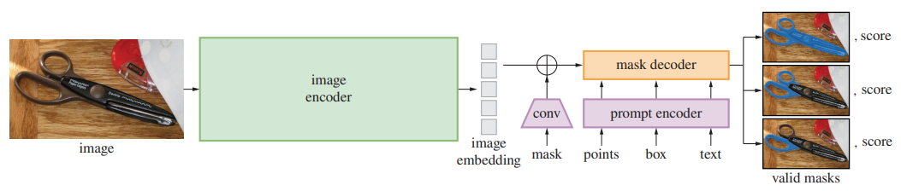

[<- Back](../README.md)

[🏠Home](../../../README.md) > [📖Tech Blog](../../README.md) > [📷Computer Vision](../README.md) > \[Paper Review\] Segment Anything

### \[Paper Review\]
# Segment Anything
2023-04-18

-----

[Paper](https://arxiv.org/pdf/2304.02643.pdf) | [Code](https://github.com/facebookresearch/segment-anything)

-----

## 목차
1. [Segment Anything Task](#1-segment-anything-task)

-----

## 1. Segment Anything Task

## 2. Segment Anything Model

- **Image Encoder** | 좋은 scalability와 강력한 pre-training method 때문에 high resolution input을 처리할 수 있게 약간 변형한 형태의 MAE pre-trained Vision Transformer (ViT)를 사용한다. 구체적으로는 14×14 windowed attention과 네 개의 equally-spaced global attention block들로 구성된 ViT-H/16를 사용한다.

